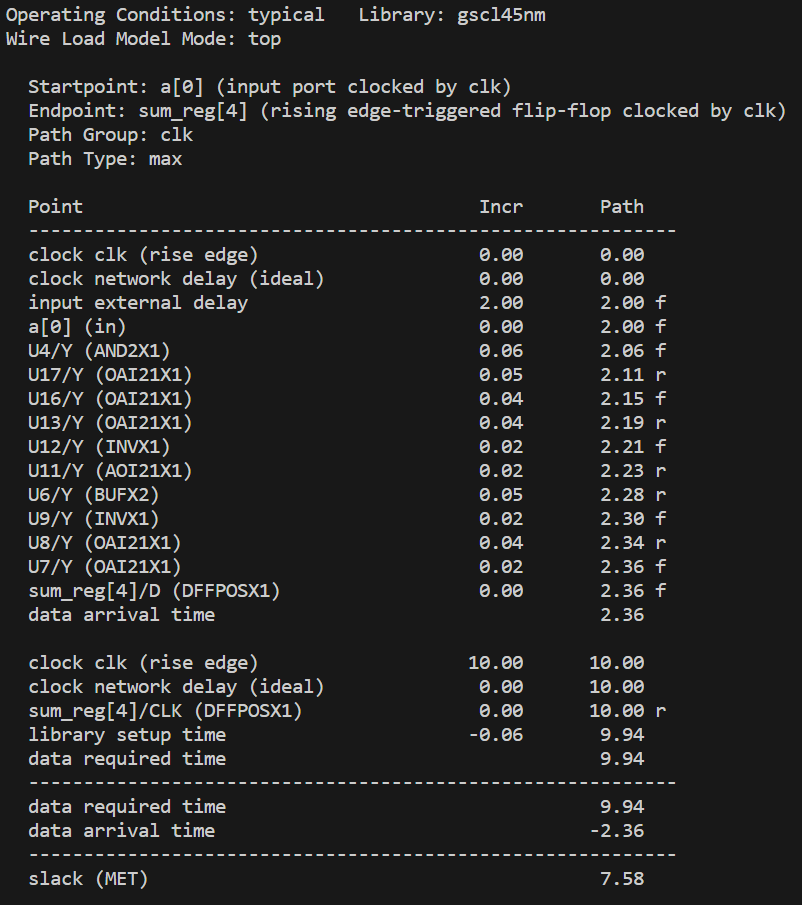
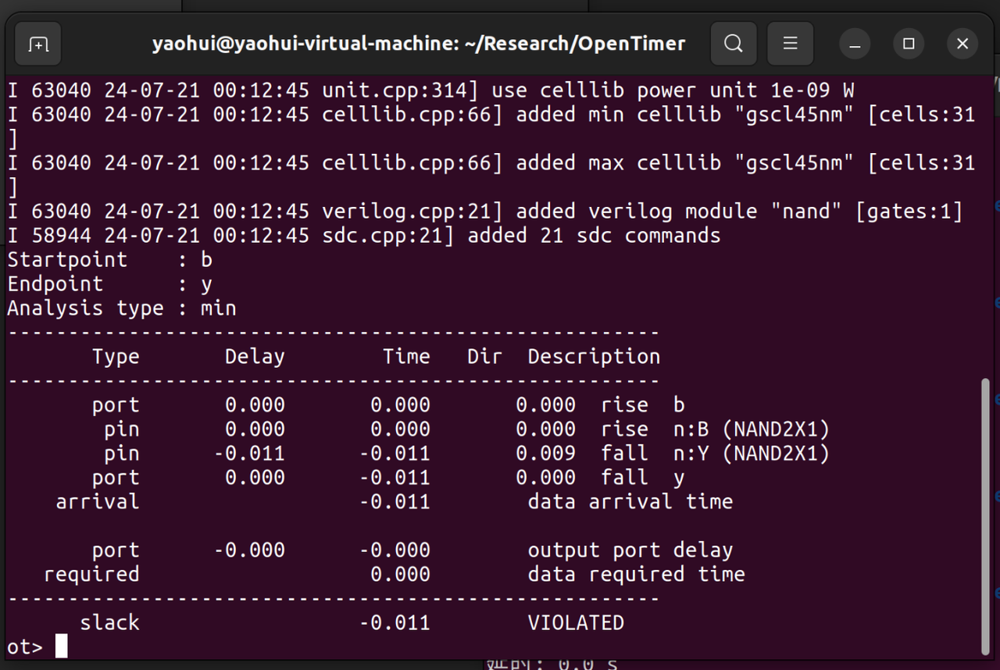

# STA Modeling and Verification

## Auto HSPICE Simulation

### Run

This process is designed to automatically run hspice scripts in large batches and generate various datasets for training. It can automatically generate waveforms and interpolate automatically to improve the accuracy of input signals.

1. Ensure there is **hspice** in the current environment.
2. Put the sub-circuit definition to `./Spice/Cirs/models/XXX.cir`.
3. Change the parameters (input transition time, load capacitance) in `./Spice/Cirs/generated/generate_hspice.py`.
4. run `python ./Spice/Cirs/main.py`.

### Splitting Data

1. Change the parameters in `./Spice/Libs/Dataset/split_data.py` to decide which voltage is for train or test
2. Run `python ./Spice/Libs/Dataset/split_data.py` to split data.

## Time Prediction through Neural ODE

### Data Format

Now, we represent the simulation result of a cell by a vector. The **type** of cell is represented by the one-hot code composed of the first three elements of the vector. The **voltage**, **load capacitance** and **input transition time** of the cell are in the 4th and 5th bits respectively. The **time propagation of high to low** (tphl) and **time propagation of low to high** (tplh) obtained by hspice simulation are stored in the last two bits respectively.

### Train and Test

This repo refers to https://github.com/EmilienDupont/augmented-neural-odes. The Dataset for Neural ODE model is saved in `./Spice/Libs/Dataset`.

1. Run `python ./NODE/train.py`, the log of training will be stored in `./NODE/log`. You can examine them in [TensorBoard](https://www.tensorflow.org/tensorboard).
2. Run `python ./NODE/test.py`, you can choose a model manually.

After training, each model will record the changes of its loss and MAPE during training and store them in `./NODE/models/ANODE_xxx`. Like these:

## Design Compiler flow

### How does Design Compiler customize library files for synthesis and timing analysis?

* Read the target library: `set target_library "./libs/cells_1.0v.db ./libs/cells_1.2v.db"`
* Read link library: `set link_library "* ./libs/cells_1.0v.db ./libs/cells_1.2v.db"`
* Read in a Verilog design: `read_verilog ./cirs/nand.v`
* Create a link: `link`
* Compile: `compile`
* Read in the sdc file: `read_sdc ./cirs/nand.sdc`
* Create operating conditions: `create_operating_conditions -name My_1.1V_Condition -voltage 1.1 -process 1.0 -temperature 27 -library [list cells_1.0v cells_1.2v]`
* To use custom operating conditions: `set_operating_conditions My_1.1V_Condition`
* Setting the load capacitance: `set_load 1.0 [get_ports y]`
* View the cells used: `report_cell`
* View the timing report: `report_timing`

The transition time is defined in the `.sdc` file, and the load capacitance is defined by `set_load`.

### How does Library Compiler converts .lib files to .db files?

* `lc_shell> read_lib xxx.lib`
* `lc_shell > write_lib -format db xxx -output xx.db`

## OpenTimer flow

Please see the details in https://github.com/OpenTimer/OpenTimer

